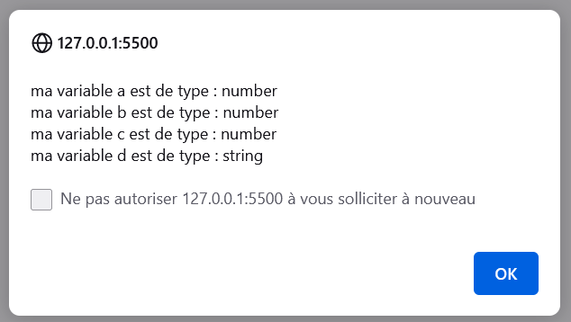
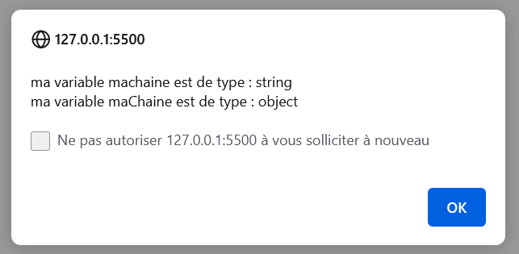

<p align="center"></img></p>
# Cours de JavaScript
## <p align="center"> Introduction au JavaScript</p>

JavaScript est un **langage de programmation de scripts** principalement employé dans **les pages web interactives** et à ce titre est une partie essentielle des applications web. Avec les langages HTML et CSS, JavaScript est au cœur des langages utilisés par les développeurs web.

## Qu’est-ce qu’une variable ?

Une variable est un conteneur servant à stocker des informations de manière temporaire, comme une chaine de caractères (un texte) ou un nombre par exemple.

Le propre d’une variable est de pouvoir varier, c’est-à-dire de pouvoir stocker différentes valeurs au fil du temps et c’est cette particularité qui les rend si utiles.

Notez bien déjà qu’une variable en soi et la valeur qu’elle va stocker sont deux éléments différents et qui ne sont pas égaux. Encore une fois, une variable n’est qu’un conteneur. Vous pouvez imaginer une variable comme une boite dans laquelle on va pouvoir placer différentes choses au cours du temps.

Les variables sont l’une des constructions de base du JavaScript et vont être des éléments qu’on va énormément utiliser. Nous allons illustrer leur utilité par la suite.


- Le nom d'une variable ne doit pas être un mot réservé
- Le nom d’une variable doit obligatoirement commencer par une lettre ou un underscore (_) et ne doit pas commencer par un chiffre ;
- Le nom d’une variable ne doit contenir que des lettres, des chiffres et des underscores mais pas de caractères spéciaux ;
- Le nom d’une variable ne doit pas contenir d’espace.

``` 
var maChaine = new String("");
var a = 42;
var b = 4.2;
var a = -42;
var a = "42";

alert("ma variable a est de type : " + typeof(a) +
"\nma variable b est de type : " + typeof(b) +
"\nma variable c est de type : " + typeof(c) +
"\nma variable d est de type : " + typeof(d)
);
```
<p align="center"></img></p>


``` 
var mahaine = "exemple";
var maChaine = new String("exemple");

alert("ma variable machaine est de type : " + typeof(machaine) +
"\nma variable maChaine est de type : " + typeof(maChaine));
```

<p align="center"></img></p>

``` 
var n = null;
var u = undefined;
var nn = NaN;

alert("ma variable n est de type : " + typeof(n) +
"\nma variable u est de type : " + typeof(u) +
"\nma variable nn est de type : " + typeof(nn));
```

<p align="center"></img></p>
